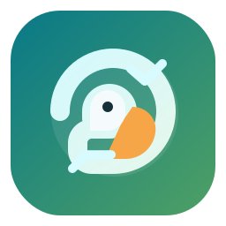

# Parrot Script



Parrot Script is a local-first meeting workspace for system-audio capture, Whisper transcription, speaker labeling, semantic search, and Ollama-based summaries.

## What It Runs

- Backend API: FastAPI on `127.0.0.1:8000`
- Frontend dev server: Vite on `127.0.0.1:5173`
- Ollama: `127.0.0.1:11434`
- Storage: local SQLite + Chroma under `data/`

After setup, the normal runtime does not require internet access. The browser UI, backend API, and Ollama can all stay on loopback (`127.0.0.1`).

## Project Layout

- `backend/`: API, transcription pipeline, diarization, storage, summarization
- `frontend/`: React + Vite UI
- `scripts/`: startup and local helper scripts
- `tests/`: unit and API tests
- `data/`: SQLite and vector-store persistence
- `docs/`: architecture, backend/frontend internals, operations, and file index

## Documentation

- Overview: [docs/README.md](/Users/charinpatel/workspace/projects/parrot-script/docs/README.md)
- Architecture: [docs/architecture.md](/Users/charinpatel/workspace/projects/parrot-script/docs/architecture.md)
- Backend internals: [docs/backend.md](/Users/charinpatel/workspace/projects/parrot-script/docs/backend.md)
- Frontend internals: [docs/frontend.md](/Users/charinpatel/workspace/projects/parrot-script/docs/frontend.md)
- Operations: [docs/operations.md](/Users/charinpatel/workspace/projects/parrot-script/docs/operations.md)
- File index: [docs/file-index.md](/Users/charinpatel/workspace/projects/parrot-script/docs/file-index.md)
- Future-agent guide: [docs/agent-guide.md](/Users/charinpatel/workspace/projects/parrot-script/docs/agent-guide.md)

## Prerequisites

Parrot Script runs locally on macOS, Linux, and Windows. You will need:

- Python `3.11+`
- Node.js `20+`
- **FFmpeg** (Required for audio + video capture)
- **Ollama** (Required for summarization)

### macOS Setup
- **FFmpeg**: `brew install ffmpeg`
- **Ollama**: `brew install ollama`
- **System Audio**: Install [BlackHole 2ch](https://existential.audio/blackhole/) to capture internal system audio. Select BlackHole as your system output, and map it in Parrot Script.
- **Screen Recording Permission (video mode)**: In **System Settings > Privacy & Security > Screen Recording**, allow the app running Parrot Script (`Terminal`, `iTerm`, or your Python host), then restart that app.

### Ubuntu Linux Setup
- **FFmpeg**: `sudo apt update && sudo apt install ffmpeg`
- **Ollama**: `curl -fsSL https://ollama.com/install.sh | sh`
- **System Audio**: FFmpeg will typically capture via PulseAudio (`pulse`) or ALSA. You may need to install `pavucontrol` to easily route your desktop audio monitor to the capture device.

### Windows Native Setup
- **FFmpeg**: Install via `winget install ffmpeg` or download binaries and add to your system PATH.
- **Ollama**: Download the Windows installer from [ollama.com](https://ollama.com/download).
- **System Audio**: Enable "Stereo Mix" in your Windows Sound Control Panel (often disabled by default). FFmpeg can capture this directly via DirectShow (`dshow`), enabling native system audio capture without virtual cables.

## One-Time Setup

1. Create and activate the virtual environment:

```bash
python3 -m venv .venv
source .venv/bin/activate
```

2. Install backend dependencies:

```bash
pip install -r requirements.txt
```

3. Install frontend dependencies:

```bash
cd frontend
npm install
cd ..
```

4. Create the runtime config:

```bash
cp .env.example .env
```

5. Review `.env` and update at least:

- `AUDIO_DEVICE_INDEX`
- `OLLAMA_MODEL`
- `API_TOKEN`
- `CORS_ORIGINS`

6. Pull the configured Ollama model:

```bash
ollama pull mistral:7b-instruct
```

7. If you are routing system audio through BlackHole, inspect device indexes:

```bash
.venv/bin/python scripts/list_audio_devices.py
```

## Environment Variables

Config is loaded from [backend/config.py](/Users/charinpatel/workspace/projects/parrot-script/backend/config.py).

### Audio / Whisper

| Variable | Default | Purpose |
|---|---|---|
| `WHISPER_MODEL` | `small.en` | Faster-Whisper model |
| `WHISPER_DEVICE` | `cpu` | Inference device |
| `WHISPER_COMPUTE_TYPE` | `int8` | Whisper compute mode |
| `WHISPER_BEAM_SIZE` | `5` | Beam search size |
| `AUDIO_DEVICE_INDEX` | `0` | FFmpeg capture index (macOS: `avfoundation`, Linux: `pulse`/`alsa`, Win: `dshow`) |
| `AUDIO_SAMPLE_RATE` | `16000` | Recording sample rate |
| `AUDIO_CHUNK_SECONDS` | `5` | Pipeline chunk size |
| `AUDIO_VAD_AGGRESSIVENESS` | `2` | WebRTC VAD aggressiveness |

### Video / Screen Capture

| Variable | Default | Purpose |
|---|---|---|
| `VIDEO_DEFAULT_RESOLUTION` | `1280x720` | Output resolution for screen recording |
| `VIDEO_FRAMERATE` | `15` | Screen capture frame rate |
| `VIDEO_CODEC` | `libx264` | FFmpeg video codec |
| `VIDEO_CRF` | `23` | Encoder quality/size tradeoff (lower = better quality, larger file) |
| `VIDEO_OUTPUT_FORMAT` | `mp4` | Container format |
| `VIDEO_SCREEN_INDEX` | `0` | AVFoundation screen device index on macOS |

### Ollama / Storage

| Variable | Default | Purpose |
|---|---|---|
| `OLLAMA_BASE_URL` | `http://127.0.0.1:11434` | Ollama endpoint |
| `OLLAMA_MODEL` | `mistral:7b-instruct` | Summary model |
| `OLLAMA_TIMEOUT` | `120` | Summary request timeout in seconds |
| `DB_PATH` | `./data/meetings.db` | SQLite path |
| `CHROMA_PATH` | `./data/chroma` | Chroma persistence path |
| `ANONYMIZED_TELEMETRY` | `False` | Disables ChromaDB usage tracking |

### API / Security

| Variable | Default | Purpose |
|---|---|---|
| `API_HOST` | `127.0.0.1` | API bind host |
| `API_PORT` | `8000` | API bind port |
| `API_RELOAD` | `false` | Dev reload toggle |
| `API_WORKERS` | `1` | Worker count when reload is off |
| `API_LOG_LEVEL` | `info` | Uvicorn log level |
| `API_TOKEN` | `change-me-local-token` | Shared bearer token for REST and WebSocket |
| `CORS_ORIGINS` | `["http://127.0.0.1:5173","http://localhost:5173","http://127.0.0.1:8501","http://localhost:8501"]` | Allowed browser origins |

### Diarization / Summary

| Variable | Default | Purpose |
|---|---|---|
| `MAX_SPEAKERS` | `8` | Max diarized speakers |
| `SPEAKER_CLUSTER_THRESHOLD` | `0.85` | Speaker clustering threshold |
| `EMBEDDING_WINDOW_SIZE` | `50` | Speaker embedding history size |
| `SUMMARY_CHUNK_SIZE` | `3000` | Transcript chunk size for map-reduce summary |
| `SUMMARY_MAX_TOKENS` | `1000` | Max generated tokens from Ollama |

Notes:

- Keep `API_HOST=127.0.0.1` unless you explicitly intend to expose the API through a reverse proxy.
- Keep `OLLAMA_BASE_URL` on `127.0.0.1` if you do not want transcript content leaving the machine.
- `API_TOKEN` must match between `.env` and the frontend security panel.
- **Audio Capture Formats**: The backend `capture.py` detects OS. macOS uses `avfoundation`, Linux uses `pulse` or `alsa`, and Windows uses `dshow`. Use `scripts/list_audio_devices.py` to find the correct `AUDIO_DEVICE_INDEX` for your specific platform format.
- **Video Capture on macOS**: Use `.venv/bin/python scripts/list_video_devices.py` and set `VIDEO_SCREEN_INDEX` to a `Capture screen ...` entry.

## Backend Start

Preferred local development:

```bash
source .venv/bin/activate
python -m backend.main --reload
```

Local run without reload:

```bash
source .venv/bin/activate
python -m backend.main --no-reload
```

Direct `uvicorn` equivalent if you prefer the raw ASGI entrypoint:

```bash
source .venv/bin/activate
uvicorn backend.api.server:app --host 127.0.0.1 --port 8000 --reload
```

Notes:

- `python -m backend.main` reads the default host, port, reload flag, worker count, and log level from `.env`.
- The ASGI app import path is `backend.api.server:app`.
- Do not run multiple backend workers for live meetings. Active pipelines and WebSocket connections are kept in process memory.

## Frontend Start

```bash
cd frontend
npm run dev
```

Open:

- Frontend: [http://127.0.0.1:5173](http://127.0.0.1:5173)
- API docs: [http://127.0.0.1:8000/docs](http://127.0.0.1:8000/docs)

On first load, enter the same `API_TOKEN` into the frontend security panel.

## Helper Startup

This starts Ollama and the backend together:

```bash
./scripts/start_meeting.sh
```

It launches:

- Ollama on `127.0.0.1:11434`
- The backend server on `127.0.0.1:8000`

## Network Behavior

- The Vite dev server is pinned to `127.0.0.1:5173`.
- The backend is pinned to `127.0.0.1:8000` by default.
- WebSocket traffic reconnects automatically with backoff after local backend restarts or transient disconnects.
- Browser offline/online state and backend reachability are surfaced in the UI.
- If internet access drops but the local backend and Ollama are still running, Parrot Script should continue to function because the runtime path is local.

Limits:

- A malicious local process on the same machine is outside the protection model of a simple API token.
- If you deliberately point `OLLAMA_BASE_URL` to a remote host, summary input leaves the machine.

## Validation Commands

Backend tests:

```bash
PYTHONPYCACHEPREFIX=/tmp/parrot-script-pycache .venv/bin/python -m pytest -q
```

Frontend typecheck:

```bash
cd frontend
npm run typecheck
```

Frontend production build:

```bash
cd frontend
npm run build
```

## Troubleshooting

### Backend not reachable

- Confirm the backend server is running on `127.0.0.1:8000`
- Open [http://127.0.0.1:8000/health](http://127.0.0.1:8000/health)
- Confirm `CORS_ORIGINS` includes the frontend origin you are using
- Confirm the UI token matches `API_TOKEN` in `.env`

### Summary returns `503`

- Start Ollama: `ollama serve`
- Confirm the model exists: `ollama list`
- Confirm `OLLAMA_BASE_URL` still points to `127.0.0.1:11434`

### No audio captured

- Verify FFmpeg is installed
- Run `.venv/bin/python scripts/list_audio_devices.py`
- Set the correct `AUDIO_DEVICE_INDEX` in `.env`
- If you want system audio, confirm BlackHole is installed and routed correctly

### No video captured on macOS

- Verify Screen Recording permission is enabled for `Terminal`/`iTerm`/your Python host:
  `System Settings > Privacy & Security > Screen Recording`
- Restart the permitted app after changing permissions
- Run `.venv/bin/python scripts/list_video_devices.py`
- Set `VIDEO_SCREEN_INDEX` in `.env` to a `Capture screen ...` device

### Runtime feels slow

- Use `tiny.en` or `base.en` instead of `small.en`
- Use a smaller Ollama model
- Keep `API_RELOAD=false` outside active development

## Hardware Guidelines

Parrot Script runs multiple AI models concurrently. Below are recommended configurations based on your available System RAM/VRAM:

| System RAM | Whisper Model | Compute Type | Ollama Model | Use Case | Notes |
|---|---|---|---|---|---|
| **16 GB** | `medium.en` | `int8_float32`| `llama3.1:8b` | Standard meeting transcription & summary | Stable everyday setup |
| **16 GB (opt)** | `medium` | `int8_float16`| `llama3.1:8b` | Better multilingual accuracy | Slightly faster |
| **24 GB** | `large-v2` | `float16` | `llama3.1:8b` | Higher transcription accuracy | Still stable |
| **32 GB** | `large-v3` | `float16` | `llama3.1:13b` | Accurate transcripts + deeper summary | Good dev machine |
| **32 GB (agent)**| `large-v3` | `float16` | `mixtral:8x7b` | Complex reasoning | Higher VRAM/RAM needed |
| **48 GB** | `large-v3` | `float16` | `llama3.1:70b-q4` | Advanced reasoning | Slower but very powerful |
| **64 GB** | `large-v3` | `float16` | `llama3.3:70b` | Near cloud-level inference | Heavy but possible |
| **64 GB (AI wk)**| `large-v3` | `float16` | `qwen2.5:72b` | Best open model reasoning | Large memory footprint |

*Tip: For 2026 setups, the `llama3.3:70b` model offers state-of-the-art reasoning for 64GB machines, replacing the older 3.1 instruct models.*

## Notes

- `.env` is gitignored. `.env.example` is the committed template.
- `tests/test_integration.py` still expects `tests/fixtures/sample_meeting.wav` for the fixture-driven full pipeline test.
- Relative paths in `.env` are resolved from the project root.
