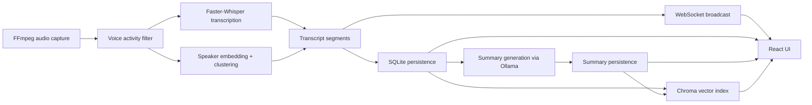

# Architecture

## Purpose

Parrot Script is a local-first meeting workspace that records system or device audio, transcribes it, labels speakers, persists results, and serves a browser UI for live monitoring, search, and summarization.

## High-Level Components

## Runtime Boundaries

- Frontend dev server: `127.0.0.1:5173`
- Backend API: `127.0.0.1:8000`
- Ollama: `127.0.0.1:11434`
- Database and vector store: local filesystem under `data/`

The intended deployment model is local-only. The backend binds to `127.0.0.1` by default, and the frontend proxy forwards `/api`, `/health`, and `/ws` to the backend.

## Primary Backend Flow

### 1. Meeting lifecycle

- User creates a meeting via `POST /api/meetings/`.
- The meeting row is inserted into SQLite with status `active`.
- User starts recording via `POST /api/meetings/{meeting_id}/start`.
- A `MeetingPipeline` instance is created and stored in the in-memory active pipeline map.

### 2. Audio capture and chunking

- `AudioCapture` starts an FFmpeg subprocess using the OS-specific device framework (`avfoundation`, `dshow`, `pulse`).
- FFmpeg emits mono 16kHz PCM audio to stdout.
- A reader thread buffers raw bytes until a configured chunk size is reached.
- `VoiceActivityDetector.filter_silent_chunks()` drops chunks with insufficient voiced frames.
- Accepted chunks are pushed into an asyncio queue as `AudioChunkEvent` objects.

### 3. Transcription and speaker labeling

- `MeetingPipeline._process_loop()` reads audio chunks from the queue.
- `WhisperTranscriber.transcribe_async()` converts PCM bytes to float audio and runs Faster-Whisper.
- `SpeakerClusterer.assign_speaker()` generates an embedding and matches it against historical centroids.
- Each recognized segment becomes a `TranscriptSegmentEvent`.

### 4. Persistence and live UI updates

- Each transcript segment is inserted into `transcript_segments`.
- Speaker labels are inserted or reused in `speakers`.
- Transcript and status updates are broadcast over WebSocket for the active meeting.
- The frontend appends new transcript rows and refreshes status badges in real time.

### 5. Stop and completion

- `POST /api/meetings/{meeting_id}/stop` stops capture, drains remaining audio, waits for the loop to finish, and marks the meeting `completed`.
- The backend writes `ended_at` and `duration_s` in SQLite.

### 6. Summary and search

- Summary requests read the full meeting transcript from SQLite.
- Long transcripts are chunked before Ollama calls.
- Summaries are stored in SQLite and indexed in Chroma with transcript chunks.
- Semantic search queries Chroma and returns a scored list of relevant snippets.

## Frontend Runtime Flow

- `App.tsx` owns the main UI state.
- API calls go through a single axios client.
- The local API token is stored in browser `localStorage`.
- `useWebSocket()` manages live stream connection state and transcript buffering.
- `useLocalRuntime()` periodically probes `/health` and tracks browser online/offline state.
- `useTheme()` persists light, dark, and system theme selection.

## Persistence Model

### SQLite tables

- `meetings`: top-level meeting lifecycle records.
- `transcript_segments`: ordered transcript data tied to a meeting.
- `summaries`: latest summary content and model metadata.
- `speakers`: generated speaker labels, optional renames, and colors.

Foreign keys are configured with `ON DELETE CASCADE` in the schema, and explicit child cleanup is also performed in repository delete logic for compatibility with existing databases.

### Chroma

- Collection name: `meetings`
- Indexes transcript chunks and summaries.
- Search returns `meeting_id`, `text`, and normalized similarity score.

## Auth and Security Model

- REST auth: bearer token in `Authorization` header.
- WebSocket auth: bearer token header or `?token=` query param.
- Public unauthenticated route: `/health`.
- Security headers are applied to all HTTP responses.
- The app is not designed to defend against malicious software already running on the same machine.

## Failure Behavior

### Backend/API failure

- The frontend health probe marks the local API as unreachable.
- Axios requests surface timeout or network-specific error messages.
- The UI retains local state but stops refreshing until backend recovery.

### WebSocket failure

- `useWebSocket()` reconnects with exponential backoff and jitter.
- Reconnect is retriggered when the browser becomes visible or regains network connectivity.
- Auth failures stop retrying and surface as `unauthorized` stream state.

### Ollama failure

- Summary routes translate Ollama connectivity failures into HTTP `503`.
- The frontend shows the error returned by the API.

## Key Design Tradeoffs

- Audio capture is local and simple, using OS-specific frameworks via FFmpeg (macOS `avfoundation`, Windows `dshow`, Linux `pulse`).
- Speaker diarization is heuristic, not a full diarization pipeline.
- Chroma indexing is appended during summarization rather than as a separate background indexing stage.
- The API token is intentionally simple. It protects the local HTTP surface but is not a replacement for a full user/session auth system.
